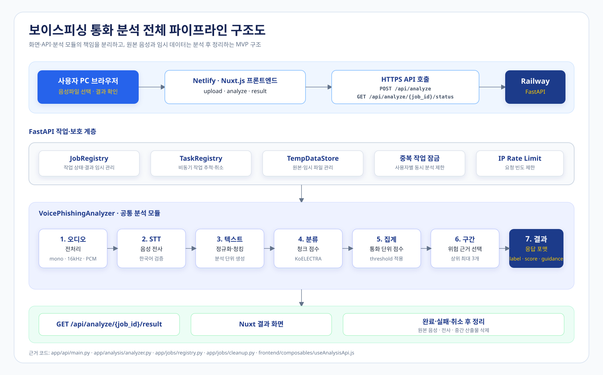

# 보이스가드 : 보이스피싱 통화 분석 및 피해 예방 서비스

> 통화 녹음파일을 분석하여 보이스피싱 의심 여부와 확인이 필요한 대화 구간을 제공하는 PC용 음성 분석 서비스입니다.
>
> **배포 상태:** 프론트엔드·백엔드 URL 제공됨 · **프론트엔드:** [voice-guard-project.netlify.app](https://voice-guard-project.netlify.app/) · **백엔드 상태:** [health 확인](https://proj1-e-production.up.railway.app/health) · [API 문서](https://proj1-e-production.up.railway.app/docs)

## 팀 정보

| 항목      | 내용                                                          |
| --------- | ------------------------------------------------------------- |
| 프로젝트  | 보이스가드 : 보이스피싱 통화 분석 및 피해 예방 서비스       |
| 조명      | E조                                                           |
| 조장      | 김호섭                                                        |
| 조원      | 심태현, 김호섭, 박진형, 윤영호, 서정현                        |
| 개발 기간 | 2주                                                           |
| MVP 형태  | Nuxt.js·FastAPI 기반 음성 파일 분석 서비스                 |

## 조원 소개

| 이름   | GitHub | 역할                 | 담당 업무                                                   |
| ------ | ------ | -------------------- | ----------------------------------------------------------- |
| 김호섭 | [SZversion](https://github.com/SZversion) | 조장·통합·백업       | 일정 및 작업 조율, 파이프라인 통합, 공통 작업 지원          |
| 심태현 | [SimonTH-0912](https://github.com/SimonTH-0912) | 보이스피싱 탐지 모델 | Dialog-KoELECTRA-Small 기반 분류 모델 및 PEFT·LoRA 미세조정 |
| 박진형 | [jinyeong-731](https://github.com/jinyeong-731) | STT·데이터 전처리                  | 음성 데이터 전처리, 평가 데이터셋 구축 및 STT 품질 검증       |
| 윤영호 | [labri70](https://github.com/labri70) | 프론트엔드               | Nuxt.js 화면 구현, 음성 파일 업로드, 분석 실행 및 결과 표시 |
| 서정현 | [SJeongHyeon](https://github.com/SJeongHyeon) | 백엔드               | FastAPI API, 비동기 분석 작업 관리 및 Railway 배포           |

---

## 프로젝트 소개

보이스피싱 통화 녹음파일을 음성 분석 모델로 처리하여, 통화 내용이 보이스피싱으로 의심되는지 판단하고 대응 행동을 안내하는 서비스입니다.

이번 MVP에서는 모바일 앱이나 통화 기능을 직접 구현하지 않습니다. Nuxt.js 프론트엔드와 FastAPI 백엔드를 통해 음성 파일 입력, STT, 텍스트 분류, 대응 안내까지 이어지는 핵심 분석 파이프라인을 검증합니다.

## Repository Structure

현재 저장소는 실행 가능한 서비스 코드와 모델·데이터 실험 자산을 분리해 관리합니다. 아래 트리에는 소스 관리 대상인 주요 폴더만 표시했으며, `node_modules`, `.nuxt`, 모델 캐시, Python 캐시와 같은 생성 폴더는 제외했습니다.

```text
.
├─ app/                         # FastAPI 백엔드와 Streamlit 로컬 테스트
│  ├─ analysis/                 # 오디오, STT, 정규화, 청킹, 교정, 품질, 분류, 집계
│  │  ├─ analyzer.py            # STT → 교정·품질 필터 → 분류 → 결과 집계
│  │  ├─ audio.py               # 오디오 입력 검증·전처리
│  │  ├─ audio_chunking.py      # 타임스탬프 기반 음성 청크 전사
│  │  ├─ chunking.py            # 텍스트 청킹
│  │  ├─ domain_corrector.py    # 검토된 도메인 오탈자 교정
│  │  ├─ transcript_quality.py  # 깨진 전사·반복 전사 품질 필터
│  │  ├─ text_normalizer.py     # 전사 텍스트 정규화
│  │  ├─ stt.py                 # STT 인터페이스
│  │  ├─ whisper_transcriber.py  # Whisper 전사 구현
│  │  ├─ onnx_classifier.py     # ONNX 분류기 구현
│  │  └─ model_loader.py        # STT·분류 모델 로더
│  ├─ api/                      # FastAPI 앱·라우트·오류 계약
│  │  └─ routes/                # 분석, 작업 상태·결과, 헬스체크 API
│  ├─ core/                     # 요청 제어 등 공통 백엔드 기능
│  ├─ jobs/                     # 비동기 분석 작업·상태·정리
│  └─ streamlit_app.py          # 로컬 파이프라인 테스트 화면
├─ frontend/                    # Nuxt 3 사용자 화면
│  ├─ pages/                    # 업로드·분석 진행·결과·도움말 화면
│  ├─ components/               # 공통 UI 컴포넌트
│  ├─ composables/              # 백엔드·Mock API 호출
│  ├─ stores/                   # 분석 작업·결과 상태
│  ├─ mocks/                    # 백엔드 없이 화면을 확인하는 Mock 데이터
│  ├─ types/                    # 프론트엔드 분석 타입
│  ├─ assets/                   # 전역 CSS
│  └─ public/                   # 아이콘·정적 파일
├─ data/                        # 원천·가공 데이터와 도메인 사전
│  ├─ raw/                      # 원본 음성·데이터셋(저장소 커밋 금지 대상 확인)
│  ├─ interim/                  # 중간 처리 결과
│  ├─ processed/                # 전처리·가공 데이터
│  ├─ labels/                   # 라벨 및 검수 결과
│  ├─ manifests/                # 데이터 분할·파일 목록
│  ├─ stt_dictionary/           # STT 어휘·도메인 교정 규칙
│  └─ stt_evaluation/           # STT 평가용 데이터·결과
├─ configs/                     # 모델·실험 설정
├─ models/                      # 로컬 모델·체크포인트(대용량 파일 커밋 금지)
├─ outputs/                     # STT·분류·평가 실행 산출물
├─ src/                         # 노트북·실험에서 사용하는 모듈형 연구 코드
│  ├─ audio/ ├─ stt/ ├─ text/ ├─ pipeline/ ├─ models/ ├─ guidance/ └─ utils/
├─ notebooks/                   # 오디오 STT·텍스트 분류·평가 노트북
├─ tests/                       # 자동 테스트
│  ├─ analysis/                 # 분석기·STT·청킹·교정·분류 테스트
│  ├─ api/                      # FastAPI·API 계약·E2E 테스트
│  ├─ jobs/                     # 작업 상태·정리 테스트
│  ├─ integration/              # 컴포넌트 통합 테스트
│  ├─ deployment/               # 배포 설정 테스트
│  ├─ tools/                    # 평가 도구 테스트
│  └─ fixtures/ · support/      # 테스트 공통 fixture·지원 코드
├─ tools/                       # 전사·평가·데이터 처리 실행 도구
├─ docs/                        # 설계·운영·성능·기능 Spec
│  └─ specs/                    # 백엔드·프론트·STT·분류·교정 Spec
├─ third_party/                 # 로컬 실행에 필요한 외부 바이너리
├─ vendor/                      # 학습·실험 보조 코드
├─ requirements.txt             # STT·학습·평가 의존성
├─ requirements-backend.txt     # FastAPI 백엔드 실행 의존성
├─ Dockerfile                   # Railway 등 컨테이너 실행 설정
└─ .env.example                 # 환경변수 이름 예시(실제 값은 커밋 금지)
```

### 서비스 코드와 실험 자산의 구분

- 서비스 실행 경로는 `app/`과 `frontend/`입니다.
- `data/`, `models/`, `outputs/`는 로컬 평가·학습 자산이며 음성 원본, 개인정보, 대용량 모델은 저장소에 커밋하지 않습니다.
- `src/`, `notebooks/`, `tools/`는 연구·평가·재현을 위한 코드입니다. 운영 API에서 사용하는 구현은 `app/` 기준으로 확인합니다.
- 도메인 오탈자 규칙은 `data/stt_dictionary/domain_corrections.json`에서 관리하며, 상세 범위와 AC는 `docs/specs/stt-domain-typo-correction.md`와 `docs/specs/stt-transcript-quality-filter.md`에 기록합니다.

### One-Line Definition

사용자가 보이스피싱 여부를 스스로 판단하기 전에 통화 내용을 분석하여 위험 징후와 대응 행동을 알려주는 음성 파일 분석 서비스입니다.

## 문제 정의

보이스피싱 통화를 정상적인 금융·수사 절차로 오인하기 쉬운 사용자는 통화 내용의 위험 징후를 즉시 판단하기 어려우므로, 통화 녹음파일을 전사·분류하여 확인이 필요한 구간과 대응 행동을 제공하는 서비스가 필요합니다.

---

## Goal

보이스피싱 통화를 정상적인 금융·수사 절차로 오인하는 사용자가 통화의 위험성을 빠르게 인지하고, 송금 중단·주변 사람에게 확인·신고 등 필요한 행동을 시작할 수 있도록 돕는 것을 목표로 합니다.

| Priority | Value     | Description                                                           |
| -------- | --------- | --------------------------------------------------------------------- |
| 1        | 피해 예방 | 보이스피싱 의심 통화를 조기에 확인하고 위험 행동을 줄임               |
| 2        | 인지 지원 | 사용자가 놓칠 수 있는 기관 사칭·긴급성·개인정보 요구 등의 징후를 표시 |
| 3        | 행동 안내 | 분석 결과와 함께 검토된 대응 행동을 제공                              |
| 4        | 모델 검증 | 음성 입력부터 통화 단위 판정까지의 E2E 파이프라인을 검증              |

---

## Target

주요 사용자는 통화 상대의 요구를 정상적인 기관 절차로 받아들여 보이스피싱 사실을 스스로 인지하기 어려운 고령자입니다.

- 기관 사칭 전화를 실제 금융·수사 절차로 오인할 수 있음
- 긴급성이나 비밀 유지 요구 때문에 가족·지인에게 확인하기 어려움
- 계좌, 대출, 본인 확인 같은 정상 상담 표현과 사기 표현을 구분하기 어려움
- 통화가 끝난 뒤에도 자신이 피해 상황에 있다는 사실을 인지하지 못할 수 있음

---

## Happy Path

```text
사용자
  ↓
+ 음성 파일 업로드
  ↓
음성 형식·재생 가능 여부 확인
  ↓
전화망 품질 기준 전처리
  ↓
Whisper 기반 한국어 STT
  ↓
텍스트 정규화 및 통화별 청킹
  ↓
Dialog-KoELECTRA-Small + PEFT·LoRA 분류
  ↓
통화 단위 위험도 집계 및 상위 점수 구간 선정
  ↓
보이스피싱 의심 여부·대응 안내 표시
  ↓
검토된 대응 문구를 제공
```

### 사용자 흐름 예시

1. 사용자가 Nuxt.js 화면에서 통화 녹음파일을 업로드합니다.
2. 시스템이 파일 형식과 재생 가능 여부를 확인합니다.
3. FastAPI가 분석 작업을 생성하고 작업 ID를 반환합니다.
4. 프론트엔드가 작업 상태를 주기적으로 확인하며 단계별 진행 상황을 표시합니다.
5. 음성을 전처리한 뒤 Whisper로 한국어 녹취문을 생성합니다.
6. 녹취문을 청크 단위로 나누어 보이스피싱 위험 점수를 계산합니다.
7. 청크 결과를 통화 단위로 통합하고, 보이스피싱 의심 시 점수가 높은 상위 3개 구간을 선정합니다.
8. 분석 결과와 대응 행동을 사용자에게 제공합니다.

---

## Features

| Feature         | Description                                     |
| --------------- | ----------------------------------------------- |
| 음성 파일 입력  | 통화 녹음파일 업로드 및 기본 형식 검증          |
| 한국어 STT      | Whisper 기반 통화 음성 전사                     |
| 보이스피싱 분류 | 정상 통화와 보이스피싱 통화의 이진 분류         |
| 위험도 산출     | 청크별 점수 계산 및 통화 단위 결과 집계         |
| 대응 안내       | 검토된 대응 문구와 행동 안내 제공               |
| Nuxt.js 화면     | 파일 업로드, 분석 상태, 결과 및 안내 표시       |

### 사용자가 할 수 있는 일

- 통화 녹음파일을 업로드하고 파일 형식·손상 여부를 확인할 수 있습니다.
- 음성을 한국어 텍스트로 전사하고, 전사문 오탈자·과도하게 깨진 구간을 정제할 수 있습니다.
- 통화 전체를 정상 통화 또는 보이스피싱 의심 통화로 분류할 수 있습니다.
- 위험도가 높은 대화 구간과 검토된 대응 행동을 확인할 수 있습니다.

## Demo

실제 서비스 시연 영상 또는 공개 가능한 음성 샘플 링크를 추가할 영역입니다.

- 배포 서비스: [voice-guard-project.netlify.app](https://voice-guard-project.netlify.app/)
- 백엔드 API 문서: [proj1-e-production.up.railway.app/docs](https://proj1-e-production.up.railway.app/docs)
- 짧은 사용 영상: [보이스가드 서비스 데모 영상](https://drive.google.com/file/d/1u3DY856VDEZkHz8jf1ajQzmT7vNgpgHn/view?usp=sharing)
- 음성 샘플: 원본 음성·전사문에 개인정보가 포함되지 않고 이용·공개 조건을 확인한 경우에만 추가

---

## Differentiation

이번 MVP는 기존 통신사·단말 중심의 실시간 탐지 서비스와 경쟁 우위를 주장하지 않습니다. 통신사, 기기에 제약받지 않고 한국어 음성 파일을 입력받아 STT부터 통화 단위 분류까지 이어지는 모델 중심 파이프라인을 검증하는 데 초점을 둡니다.

| Existing Limitation                                             | This Project                                                          |
| --------------------------------------------------------------- | --------------------------------------------------------------------- |
| 사용자가 먼저 의심해야 번호 조회·신고를 시작할 수 있음          | 통화 내용을 분석하여 사전 의심 없이 위험 징후를 확인할 수 있도록 지원 |
| 단어 하나만으로는 정상 금융 상담과 보이스피싱을 구분하기 어려움 | 통화 문맥과 여러 위험 표현의 결합을 분류                              |
| 긴 통화에서 사람이 전체 내용을 다시 확인하기 어려움             | 점수가 높은 상위 대화 구간을 우선 표시                         |
| 모델 결과를 범죄 확정 판정으로 오해할 수 있음                   | 참고 정보·모델 한계·대응 안내를 함께 표시                             |
| 데이터 출처와 통화 품질에 따라 성능이 달라질 수 있음            | 독립 Test, 정상 금융상담 Hard Negative, 저음질 평가를 분리            |

---

## Data & Models

### Data

현재 계획은 보이스피싱 양성 데이터와 다양한 정상 통화 데이터를 조합하는 것입니다.

| Class / Purpose  | Data Source                      | Usage                                     |
| ---------------- | -------------------------------- | ----------------------------------------- |
| 보이스피싱 양성  | 금융감독원 보이스피싱 음성자료   | 보이스피싱 통화 학습·검증                 |
| 금융 상담 통화   | AI-Hub 정상 상담 음성 데이터     | 필요에 따라 정제·수정 후 STT 학습·검증 및 금융상담 오탐 평가 |
| 저음질 평가       | 금융감독원 보이스피싱 음성자료의 전처리 샘플 | 8kHz·16kHz 조건별 전화망 품질 강건성 비교 |

### Data Processing Principles

- 통화 단위로 Train·Validation·Test를 먼저 분리합니다.
- 같은 통화의 청크가 서로 다른 세트에 섞이지 않도록 합니다.
- 음성 입력은 mono·8kHz·16-bit PCM 기준으로 통일합니다.
- 모든 데이터에 동일한 Whisper 설정을 적용합니다.
- 기관 사칭, 송금, 앱 설치, 비밀 유지, 고립 유도 등 핵심 위험 표현은 삭제하지 않습니다.
- 데이터 출처와 클래스가 서로 강하게 연결될 경우 출처 단서를 모델이 학습할 수 있으므로 분포 비교와 오류 분석을 수행합니다.

### STT 개선·평가 데이터 구성

README에 기재한 데이터 출처를 기반으로, STT 개선 과정에서는 목적에 따라 데이터를 별도 가공해 사용했습니다. 원본 음성·전체 전사문·대용량 정제 데이터는 GitHub에 저장하지 않고 외부 또는 로컬 경로에서 관리합니다.

| 목적 | 데이터 출처 | 실제 구성·처리 |
| --- | --- | --- |
| 보이스피싱 학습·검증 | 금융감독원 보이스피싱 음성자료 | 보이스피싱 통화 학습·검증 |
| 정상 통화 학습·검증 | AI-Hub 정상 상담 음성 데이터 | 필요에 따라 정제·수정 후 사용 |
| 기본 STT 평가 | 금융감독원 보이스피싱 자료 | `impersonation` 15개 + `loanScam` 15개, 총 30개 통화 |
| 대표 샘플 평가 | 금융감독원 보이스피싱 자료 | `36549~36553` 5개 통화 |
| 샘플레이트 비교 | 대표 샘플 평가 데이터 | 동일 샘플을 8kHz·16kHz로 각각 전처리해 CER/WER 비교 |
| Whisper LoRA 학습 | AI-Hub 정상 상담 데이터 + 금융감독원 보이스피싱 데이터 | D03 정상 통화 100건 + 보이스피싱 원본 48건을 WAV/TXT 쌍으로 정제 |
| 데이터 분할 | 학습·평가 데이터 | 원본 통화 기준 Train·Validation·Test 분할 |
| 음성 전처리 | 학습·평가 데이터 | 20~30초 청킹, 10% overlap, 샘플레이트·채널·음량 정규화 |
| 추가 정제·증강 | 보이스피싱 음성자료 | 삐 소리 점검·복원, 필요 시 속도 변형·제한적 노이즈 추가 |
| 데이터 관리 | 전체 데이터 | 원본 음성·전체 전사문·대용량 정제 데이터는 GitHub에 저장하지 않음 |

STT 개선용 정제 데이터에는 다음 처리를 적용했습니다.

- 원본 통화 기준 Train·Validation·Test 분할
- 20~30초 청킹 및 10% overlap
- 음성 샘플레이트·채널·음량 정규화
- 보이스피싱 자료의 삐 소리 구간 점검·복원
- 필요에 따른 속도 변형과 제한적인 노이즈 추가
- WAV/TXT 파일 쌍 검증 및 데이터 이슈 기록

`36549~36553`은 별도 출처의 데이터셋이 아니라 금융감독원 보이스피싱 자료에서 선정한 평가 샘플입니다. 8kHz·16kHz 결과도 별도 데이터셋 비교가 아니라 동일 샘플에 대한 전처리 조건 비교입니다.

### Models

| Stage               | Model / Technology                        | Purpose                                  |
| ------------------- | ----------------------------------------- | ---------------------------------------- |
| Audio Preprocessing | FFmpeg · librosa · torchaudio             | 음성 형식·샘플링·길이·음량 처리          |
| STT                 | Faster-Whisper (Whisper-small 계열)       | 한국어 통화 음성 전사 및 타임스탬프 생성 |
| TTS                 | 사용하지 않음                             | MVP 범위 외                             |
| Text Classification | Dialog-KoELECTRA-Small ONNX INT8         | 청크별 정상/보이스피싱 위험 점수 산출    |
| Evidence Search     | 청크 점수 기반 상위 구간 선정              | 보이스피싱 의심 시 점수가 높은 상위 3개 구간 제공 |
| Production UI       | Nuxt.js                                  | 음성 파일 업로드, 분석 상태 및 결과 표시       |

> 프로젝트 결과는 공식적인 범죄·수사 판정이 아니라 모델 기반 참고 정보입니다. 상위 점수 구간은 분석 결과를 확인하기 위한 참고 정보입니다.

---

## Service Flow

```text
음성 파일
    ↓
오디오 전처리
    ↓
Whisper 한국어 STT
    ↓
텍스트 정규화 및 청킹
    ↓
Dialog-KoELECTRA-Small + LoRA 분류
    ↓
청크 결과 통합
    ↓
통화 단위 판정 및 상위 점수 구간 선정
    ↓
Nuxt.js 결과 화면
```



### 결과 구성

- 보이스피싱 의심 여부
- 통화 단위 위험도
- 보이스피싱 의심 시 점수가 높은 상위 3개 대화 구간
- 모델 결과의 참고 정보 안내
- 사용자가 취할 수 있는 대응 행동

---

## Scope

### In-Scope: 이번 MVP에 포함

- 음성 파일 업로드
- 음성 형식 및 손상 파일 확인
- 전화망 품질 기준 음성 전처리
- Whisper 기반 한국어 STT
- 통화별 텍스트 정규화 및 청킹
- 정상/보이스피싱 이진 분류
- 청크 결과의 통화 단위 집계
- 상위 점수 대화 구간 표시
- 고정 대응 문구 안내
- Nuxt.js 기반 운영 화면
- 비동기 분석 작업 및 단계별 진행 상태 표시
- STT·분류·통화 단위 집계의 성능 평가
- 분석 완료 후 원본 음성·녹취문 삭제

### Out-of-Scope: Later 또는 제외

- 모바일 앱 개발
- 스마트폰 자동녹음 파일 자동 탐색·연동
- 통화 종료 감지 및 백그라운드 자동 분석
- 통화 중 실시간 분석
- 전화번호 자동 차단
- 자동 신고 및 보호자 연락
- 딥페이크·딥보이스 판별
- 회원가입 및 분석 이력 저장
- 앱 푸시 알림
- 법적·수사적 확정 판정

---

## Priority

### MVP

음성 파일 입력 · 한국어 STT · 보이스피싱 이진 분류 · 비동기 분석 및 단계별 진행 상태 · 상위 3개 구간 표시 · 대응 안내 · Nuxt.js·FastAPI 서비스 · 통화 단위 성능 평가

### Later Goals

모바일 앱 구현 · 녹음 파일 자동 분석 · 저음질 음성 예외 처리 · 추가 음성 파일 형식 지원 · UI 시각적 완성도 향상

---

## Validation

| Evaluation         | Criteria                                                          |
| ------------------ | ----------------------------------------------------------------- |
| STT 품질           | 사람이 검수한 전사와 Whisper 전사의 CER·WER 비교                  |
| 텍스트 분류        | TF-IDF + Logistic Regression과 Dialog-KoELECTRA-Small + LoRA 비교 |
| 보이스피싱 탐지    | Recall, FNR, FPR, Precision, F1 측정                              |
| 통화 단위 판정     | 최대 위험도·평균 위험도·상위 청크 평균 방식 비교                  |
| 정상 금융상담 오탐 | 독립 Hard Negative Test Set에서 FPR 측정                          |
| 저음질 강건성      | 전화망 품질 조건에서 성능 하락폭과 CER 측정                       |
| 오류 분석          | False Negative·False Positive 대표 문장, 점수, 음질, 출처 기록    |
| E2E 동작           | 음성 업로드부터 결과 표시 안내까지 전체 흐름 확인                 |
| 개인정보 처리      | 분석 완료 후 원본 음성·녹취문·임시 데이터 삭제 확인               |

### 실험 결과

#### STT 평가

금융감독원 보이스피싱 평가 샘플 중 `36549~36553`에 해당하는 동일 5개 통화를 사용했습니다. 8kHz와 16kHz 전처리 조건을 비교하고, 사람이 작성한 정답 전사문과 비교하여 CER과 WER를 측정했습니다.

| 실험 조건 | 평가 통화 수 | 평균 CER | 평균 WER |
| --- | ---: | ---: | ---: |
| 8kHz 전처리 | 5 | 0.3260 | 0.5843 |
| 16kHz 전처리 | 5 | 0.2994 | 0.5572 |
| Base Whisper-small 테스트 | 30 | 0.3309 | 0.6046 |

16kHz 전처리는 8kHz 전처리보다 CER이 `0.0266`, WER가 `0.0271` 낮았습니다.

#### 보이스피싱 분류 평가

총 499개 샘플을 대상으로 원본 전사문과 오탈자 보정 전사문의 분류 결과를 비교했습니다. 양성 클래스는 보이스피싱으로 정의했습니다.

| 입력 전사문 | TP | TN | FP | FN | Accuracy | Precision | Recall | F1 | FPR | FNR |
| --- | ---: | ---: | ---: | ---: | ---: | ---: | ---: | ---: | ---: | ---: |
| 원본 전사문 | 194 | 155 | 148 | 2 | 69.94% | 56.73% | 98.98% | 72.12% | 48.84% | 1.02% |
| 오탈자 보정 전사문 | 194 | 155 | 148 | 2 | 69.94% | 56.73% | 98.98% | 72.12% | 48.84% | 1.02% |

오탈자 보정으로 전사문이 변경된 샘플은 11건이었으나, 최종 분류 결과가 변경된 샘플은 0건이었습니다.

이번 평가에서는 보이스피싱 Recall이 98.98%, FNR이 1.02%로 보이스피싱을 놓치는 비율은 낮았습니다. 반면 정상 통화를 보이스피싱으로 판단한 FPR은 48.84%로 높아, 정상 금융상담 Hard Negative를 활용한 추가 평가와 임계값 조정이 필요합니다.

> 위 결과는 현재 저장소의 로컬 평가 산출물 기준입니다. 독립 Test Set 여부와 세부 데이터 분할을 최종 확인한 뒤 공식 성능으로 사용해야 합니다. 모델 결과는 법적·수사적 확정 판정이 아닌 참고 정보입니다.

### Evaluation Priority

보이스피싱을 놓치는 상황을 줄이기 위해 Recall과 FN/FNR을 우선 확인합니다. 동시에 모든 통화를 보이스피싱으로 판단하는 모델을 방지하기 위해 정상 금융상담 FPR, Precision, F1을 함께 보고합니다.

---

## Success Criteria

이번 프로젝트의 성공은 단순히 모델이 실행되는 것만이 아니라, 음성 파일 하나가 입력된 뒤 통화 단위 결과와 근거 정보까지 일관되게 제공되는지를 기준으로 판단합니다.

- 음성 파일 입력부터 STT·분류·대응 안내까지 E2E 파이프라인 실행
- 보이스피싱 탐지 Recall, FNR, FPR, F1을 독립 Test Set 기준으로 측정
- 정상 금융상담 Hard Negative에서 오탐을 별도로 확인
- 저음질 전화망 음성에서 성능 변화를 확인
- 모델 결과를 확정 판정으로 오해하지 않도록 안내 문구 표시
- 분석 완료 후 원본 음성·녹취문·임시 데이터 삭제
- Nuxt.js 화면에서 사용자가 분석 결과와 다음 대응 행동을 이해할 수 있음

---

## 2주 실행 계획

| 기간    | 핵심 작업                                | 체크포인트                               |
| ------- | ---------------------------------------- | ---------------------------------------- |
| 1일     | 데이터 이용 조건·표본·품질 확인          | 데이터 Go / No-Go 결정                   |
| 2~3일   | 전화망 품질 전처리·Whisper·텍스트 정규화 | 출처 단서와 편향 점검                    |
| 4일     | 통화 단위 분할·청킹·독립 Test 구성       | Main·Hard Negative·Low-quality Test 구성 |
| 5~7일   | LoRA 학습·STT·분류 통합                  | 1차 모델 및 파이프라인 결과              |
| 8~10일  | 임계값·청크 집계 방식·FN/FP 분석         | Recall·FPR·오류 원인표                   |
| 11~13일 | E2E 평가·개인정보·예외·회귀 테스트       | 삭제 확인 및 평가표                      |
| 14일    | 시연·문서·발표 정리                      | 최종 데모                                |

---

## Limitations & Risks

| Risk                      | Impact                                     | 대응                                                   |
| ------------------------- | ------------------------------------------ | ------------------------------------------------------ |
| 양성 데이터 부족          | 학습·평가 신뢰도 저하                      | 데이터 이용 조건과 표본 수를 초기 확인                 |
| 데이터 출처와 클래스 상관 | 통화 내용이 아닌 출처·음질을 학습할 가능성 | 출처별 분포 비교와 독립 Test 수행                      |
| STT 오류                  | 분류 입력 왜곡                             | Clean·Whisper·전화망 품질 단계별 평가                  |
| 정상 금융상담 오탐        | 사용자 불안과 불필요한 행동 유발           | Hard Negative에서 FPR 평가                             |
| 개인정보 노출             | 법적·윤리적 위험                           | 비저장·즉시 삭제·로그 제한                             |
| 모델 결과 오해            | 법적 판정으로 잘못 이해할 가능성           | 참고 정보 및 모델 한계 명시                            |
| 상용 서비스와 기능 중복   | 독창성·시장성 주장 약화                    | 상용 서비스보다 우수하다고 주장하지 않고 MVP 범위 명시 |

---

## Installation & Usage

### 음성 STT·화자 분리 라벨 생성

`data/raw/impersonation`과 `data/raw/loanScam`의 음성을 Faster-Whisper로 전사하려면 [Whisper LoRA 실행 가이드](docs/whisper_lora_finetuning_guide.md)를 참고합니다.

### CPU STT 실행

```powershell
& "E:\Program Files\whisperx-env\Scripts\python.exe" -m tools.faster_whisper_stt `
  --input data/raw `
  --output data/processed_stt `
  --language ko `
  --model small `
  --device cpu `
  --compute-type int8 `
  --limit 2
```

정확도가 부족한 파일만 `--model medium`으로 재처리합니다. 화자 분리는 수행하지 않으며, 결과는 LLM 파인튜닝용 `transcript.txt`와 `segments.jsonl`로 저장합니다.

### Whisper LoRA 파인튜닝

같은 폴더의 음성·정답 TXT 쌍으로 Whisper-small을 LoRA 파인튜닝하려면 [Whisper LoRA 실행 가이드](docs/whisper_lora_finetuning_guide.md)를 참고합니다. 먼저 `--dry-run`으로 데이터 쌍과 분할을 확인한 뒤 CUDA 환경에서 학습을 실행합니다.

### 로컬 실행 방법

```powershell
git clone https://github.com/aihuman-7th/proj1-e.git
cd proj1-e

# 백엔드 가상환경 및 의존성 설치
python -m venv .venv
.venv\Scripts\Activate.ps1
pip install -r requirements-backend.txt

# 백엔드 실행: 별도 터미널
uvicorn app.api.main:app --host 0.0.0.0 --port 8000

# 프론트엔드: 새 터미널
cd frontend
pnpm install
pnpm dev
```

프론트엔드 기본 주소는 `http://localhost:3000`이며, 실제 FastAPI와 연결하려면 `frontend/.env`에 다음을 설정합니다.

```env
NUXT_PUBLIC_USE_MOCK=false
NUXT_PUBLIC_API_BASE=http://localhost:8000/api
```

`NUXT_PUBLIC_USE_MOCK=true`이면 백엔드 없이 Mock API로 화면 흐름만 확인할 수 있습니다. 백엔드 API 문서는 `http://localhost:8000/docs`, 헬스체크는 `http://localhost:8000/api/health`에서 확인합니다.

### 화면 흐름

1. Nuxt.js 화면에서 음성 파일을 업로드합니다.
2. 분석 시작 버튼을 누릅니다.
3. 작업 상태를 확인하며 단계별 분석 진행 상황을 확인합니다.
4. 보이스피싱 의심 여부와 위험도를 확인합니다.
5. 의심 결과인 경우 상위 3개 대화 구간과 대응 안내를 확인합니다.

---

## Collaboration Rules

1. `main`에 직접 push하지 않습니다. 모든 변경은 브랜치와 PR을 통해 반영합니다.
2. 브랜치명은 `feat/{작업내용}`을 사용하고, 버그 수정은 `fix/{내용}`을 사용합니다.
3. PR은 조원 1명 이상의 approve를 받은 뒤 merge합니다.
4. 자기가 한 작업은 본인 GitHub 계정으로 커밋합니다.
5. API 키·비밀번호는 `.env`에만 저장하며, `.env` 파일은 커밋하지 않습니다.
6. 기능 구현 전에 `docs/specs/{기능명}.md`에 Spec을 작성합니다.

자세한 AI 에이전트 작업 지침은 [AGENTS.md](./AGENTS.md)를 참고하세요.

## 라이선스·윤리 고지

- 사용 모델과 데이터셋은 각 배포처의 라이선스·이용 조건을 확인한 뒤 사용하며, 모델별 정확한 라이선스 표기는 최종 배포 전에 확정합니다.
- 음성 원본·전사문은 저장소에 커밋하지 않으며, 분석 중 임시 데이터는 작업 종료 후 삭제합니다. 얼굴 데이터는 사용하지 않습니다.
- 결과는 법적·수사적 확정 판정이 아닌 모델 기반 참고 정보이며, 실제 대응 전 관련 기관이나 전문가의 확인이 필요합니다.
